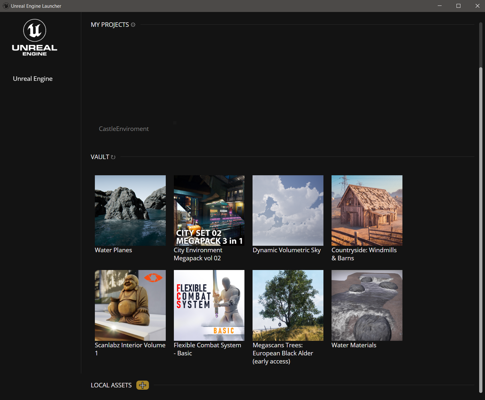

This is a Fork of <a herf=https://github.com/nmrugg/UE4Launcher>UE4Launcher</a>.
Thanks.

<h1>Unofficial Unreal Marketplace Downloader</h1>

<strong><pre>This is a work in progress.</pre></strong>

This project is an unofficial Marketplace downloader for <a href="https://www.unrealengine.com/">Unreal Engine </a> for those who Hate Epic Games (apart from UE) and don't want to have to download EGL to download assets from the UE Marketplace and for those on <strong>Linux</strong>.

Platforms: Windows & Linux.

<h2>Features</h2>

The Manager is incomplete; however, it should be able to preform most of the important tasks (Downloading Assets!).

It download and install assets and plugins from the <a href="https://www.unrealengine.com/marketplace/en-US/store">UE Marketplace</a>.

Two-factor support has not yet been tested.


<h2>Screenshots</h2>

Login Screen


My Projects


Add Assets Menu


Downloading Assets


Asset Installed in UE4


Learn Tab


<h2>Installation</h2>

1. install <a href=https://nodejs.org/en/download/>node.js</a>.

2. Then Download the project:
<a herf=https://github.com/JMBROGB666/UEAssetDownloader/archive/refs/heads/master.zip>Download</a>

3. Open CMD, Powershell or your Terminal and enter the command bellow:
```bash
cd C:\users\...\UEAssetDownloader
```

4. Endter the command bellow to Install the dependencies:
```bash
npm i
```


5. Launch UEAssetDownloader by running Run Unreal Marketplace Manager.bat.


(Run command)
```bash
npm start
```

Hope for the best.
